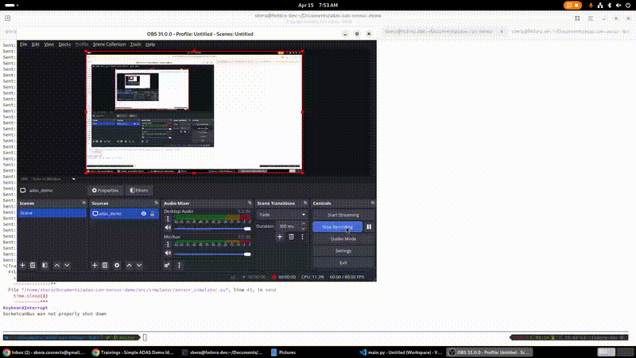

[]


# ADAS CAN Sensor Simulator & Visualizer

A complete Python-based Advanced Driver Assistance System (ADAS) demo that simulates CAN-based sensor data, processes it for Forward Collision Warning (FCW), visualizes it in real-time, and provides multiple interfaces including CLI, live plot, and a web dashboard.

---

## 🎥 Demo Preview




---

## 🚀 Features

- **CAN Sensor Simulator** using `python-can`
- **ADAS Processor** with TTC (Time-To-Collision) and FCW logic
- **CLI Dashboard** for real-time terminal output
- **Live Plot** using `matplotlib`
- **Dash Web Dashboard** with interactive plots
- **CSV Logging** and Replay
- **Tested with Pytest** and CI-ready
- **Dockerized for portability**
- **Editable Python package** with CLI entry point

---

## 🗂️ Project Structure

```
adas-can-sensor-demo/
├── config/                # YAML configuration files
├── data/                  # CSV log files
├── logs/                  # Runtime and Dash logs
├── scripts/               # Utility scripts (replay, plotting, launchers)
├── src/                   # Core Python modules
│   ├── canbus/            # CAN interface and message parsing
│   ├── processor/         # ADAS processing logic and logger
│   ├── simulator/         # CAN sensor simulator
│   ├── visualizer/        # CLI + live plot + Dash web UI
│   ├── config/            # YAML config loader
│   └── main.py            # CLI entry point
├── tests/                 # Pytest unit tests
├── requirements.txt
├── setup.py               # Package installer
├── Dockerfile             # Docker support
└── README.md
```

---

## ⚙️ Installation

### 🔧 Local Development (Editable)

```bash
pip install -e .
```

Now you can run it globally with:
```bash
adas-demo --mode live
```

### 🐳 Docker
```bash
docker build -t adas-can-demo .

docker run --rm -v "$PWD/data:/app/data" adas-can-demo
```

To enable web dashboard:
```bash
docker run -p 8050:8050 \
  -v "$PWD/data:/app/data" \
  -v "$PWD/config:/app/config" \
  -v "$PWD/logs:/app/logs" \
  adas-can-demo python scripts/run_live_web.py
```

Then open [http://localhost:8050](http://localhost:8050)

---

## 🕹️ Usage

### ✅ Live Mode

#### CLI + Matplotlib Live Plot
```bash
python3 src/main.py --mode live
```

#### Web Dashboard (Dash UI)
```bash
python3 scripts/run_live_web.py
```

### 🔁 Replay Mode
```bash
python3 src/main.py --mode replay --file data/demo_drive_log.csv --delay 0.3
```

### 📊 Plot Replay Log (Static Matplotlib Graph)
```bash
python3 scripts/plot_log.py
```

---

## 🧪 Testing

```bash
pytest
```

Includes unit tests for:
- TTC calculation
- FCW logic
- CAN message decoding

---

## ⚠️ CI Test Limitation (vcan0)

Some tests (e.g., `CANInterface`) require a virtual CAN device (`vcan0`) which is not available in GitHub Actions environments. As such:

- These tests are intended to run on Linux systems with `vcan` enabled.
- To run them locally:

```bash
sudo modprobe vcan
sudo ip link add dev vcan0 type vcan
sudo ip link set up vcan0
pytest


## 📦 Makefile Commands

Use these handy shortcuts to run and test your project:

```bash
make install         # pip install -e .
make run             # live mode with matplotlib
make replay          # replay mode from CSV
make web             # run Dash web dashboard
make plot            # static matplotlib graph
make test            # run all pytest unit tests
make docker-build    # build Docker image
make docker-run-web  # run dashboard inside container
```

---

## 🧰 Configuration

Edit the YAML file at `config/adas_config.yaml`:
```yaml
can_interface: vcan0

adas:
  ttc_threshold: 2.0
  min_speed_kph: 20

dashboard:
  max_points: 50
  update_interval_ms: 1000

web:
  port: 8050
  enable_web_ui: true
```

---

## ✅ Roadmap

- [x] CAN simulation and FCW logic
- [x] CLI dashboard
- [x] Matplotlib-based live plot
- [x] Dash web UI
- [x] Configurable via YAML## 🎥 Demo Preview


- [ ] Optional REST API or MQTT interface

---

## 📄 License
MIT License

---

## 👨‍💻 Author
**Sudhir Kumar Bera**  
Senior Embedded & Automotive Software Engineer

